# Divorce Prediction Analysis


Machine learning analysis of marriage outcomes using 5,000 synthetic couples to identify predictive patterns, risk factors, and relationship dynamics.

## Overview

Three complementary analysis frameworks examine what actually predicts divorce through classification models, survival analysis, and advanced probability mapping.

| Framework | Focus | Visualizations |
|-----------|-------|----------------|
| **Prediction Analysis** | Classification models and feature importance | 4 visualization suites |
| **Advanced Profiling** | Survival curves and relationship archetypes | 4 visualization suites |
| **Network & Probability** | Feature networks and density mapping | 4 visualization suites |
| **Educational Synthesis** | Plain language explanations of methodology | Interactive HTML document |

## Dataset

**Source:** Synthetic dataset simulating realistic marriage conditions

| Attribute | Value |
|-----------|-------|
| Total Couples | 5,000 |
| Features | 21 predictors + 1 target |
| Outcome Variable | Divorced (binary: 0 or 1) |
| Feature Types | Numeric, categorical, engineered |

### Key Variables

| Category | Variables |
|----------|-----------|
| Demographics | Age at marriage, marriage duration, education level |
| Economic | Combined income, employment status |
| Relationship | Communication score, conflict frequency |
| Family | Number of children |
| Compatibility | Religious compatibility, cultural background match |

## Key Features

### Classification & Prediction
Random Forest, Gradient Boosting, and Logistic Regression models identify strongest predictors. ROC curves evaluate performance. Confusion matrices reveal error patterns. Interaction effects show how variables compound.

### Survival Analysis
Kaplan-Meier curves track marriage longevity. Hazard functions identify high-risk periods. Relationship profiling through K-means clustering discovers five distinct archetypes from Harmonious to Distressed.

### Network & Probability Mapping
Graph-based feature relationships visualize interconnections. 2D probability density maps show risk across variable combinations. Partial dependence plots isolate individual feature effects. Waterfall charts decompose predictions.

## Installation

```bash
git clone https://github.com/Cazzy-Aporbo/Divorce-Prediction.git
cd Divorce-Prediction
pip install pandas numpy matplotlib seaborn scikit-learn scipy networkx
```

## Usage

### Prediction Analysis
```bash
python divorce_prediction_analysis.py
```

Generates:
- predictive_power_analysis.png
- classification_performance.png
- relationship_dynamics_matrix.png
- interaction_effects_analysis.png

### Advanced Profiling
```bash
python divorce_advanced_profiling.py
```

Generates:
- survival_analysis_curves.png
- risk_profiling_matrix.png
- temporal_pattern_analysis.png
- multidimensional_relationship_space.png

### Network & Probability
```bash
python divorce_network_probability.py
```

Generates:
- feature_network_graph.png
- probability_density_maps.png
- partial_dependence_analysis.png
- feature_contribution_waterfall.png

### Educational Documentation
Open `divorce_analysis_synthesis.html` in any browser for plain language explanations of the math and methodology.

## Visualizations

### Predictive Power Analysis
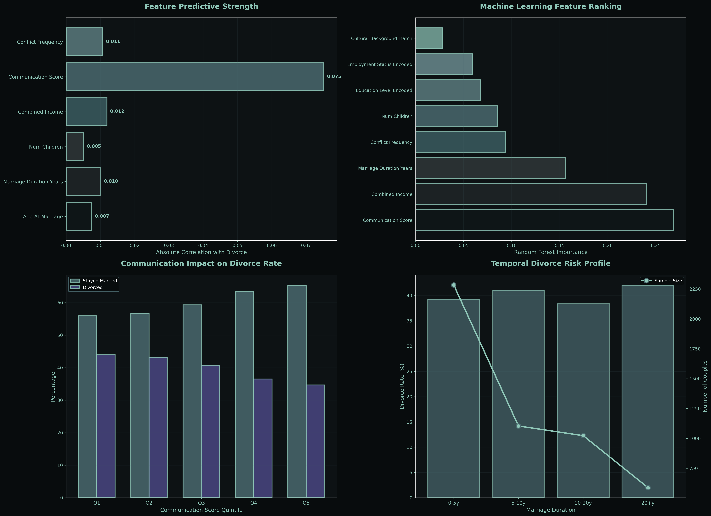
Feature correlation with divorce outcome, Random Forest importance rankings, communication impact stratification, and temporal risk profiles.

### Classification Performance

ROC curves comparing three models, confusion matrix showing prediction accuracy, decision tree logic visualization, and threshold optimization analysis.

### Relationship Dynamics Matrix
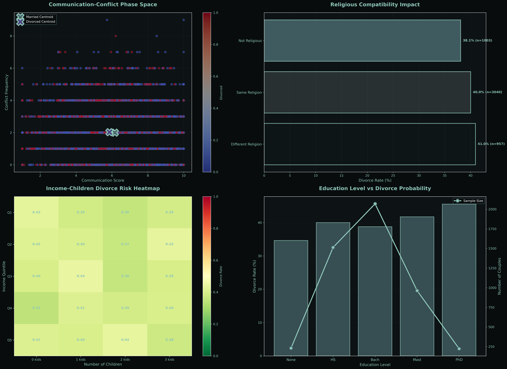
Communication-conflict phase space mapping, religious compatibility impact, income-children risk heatmap, and education level effects.

### Interaction Effects Analysis
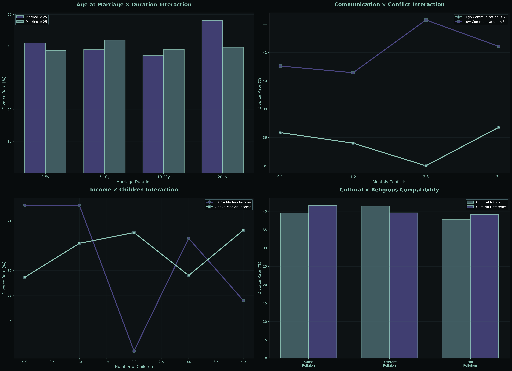
Age-duration interactions, communication-conflict compounding, income-children relationships, and cultural-religious compatibility patterns.

### Survival Analysis Curves
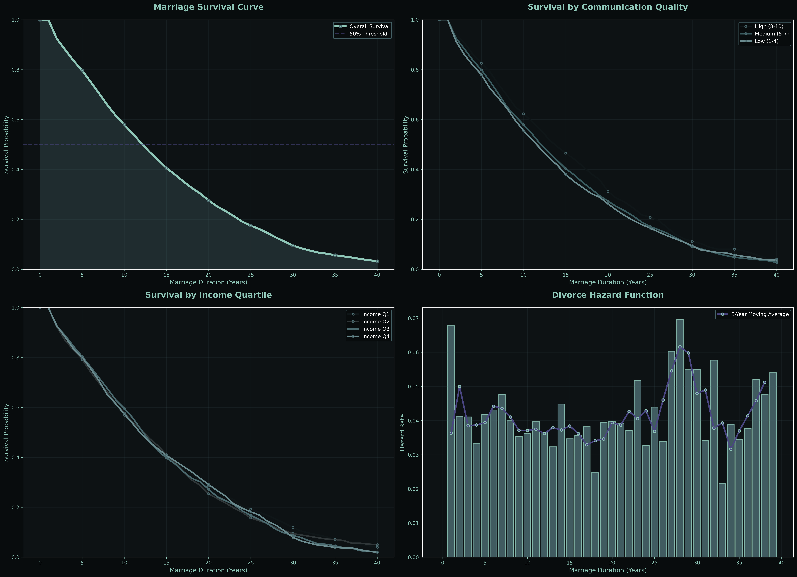
Marriage survival probability over time, stratified by communication quality and income quartiles, plus hazard function showing danger zones.

### Risk Profiling Matrix
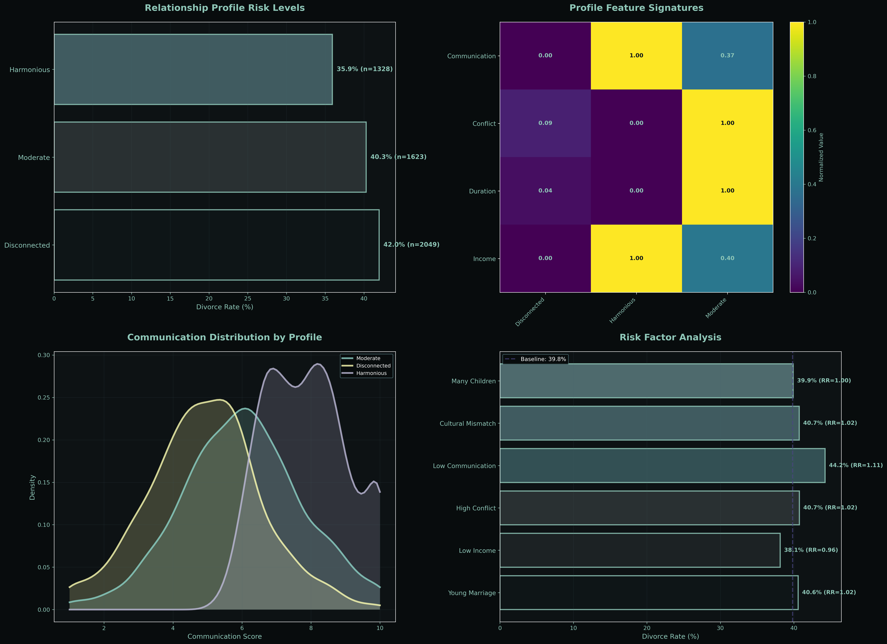
Five relationship archetypes with divorce rates, profile feature signatures, communication distributions, and comparative risk factor analysis.

### Temporal Pattern Analysis
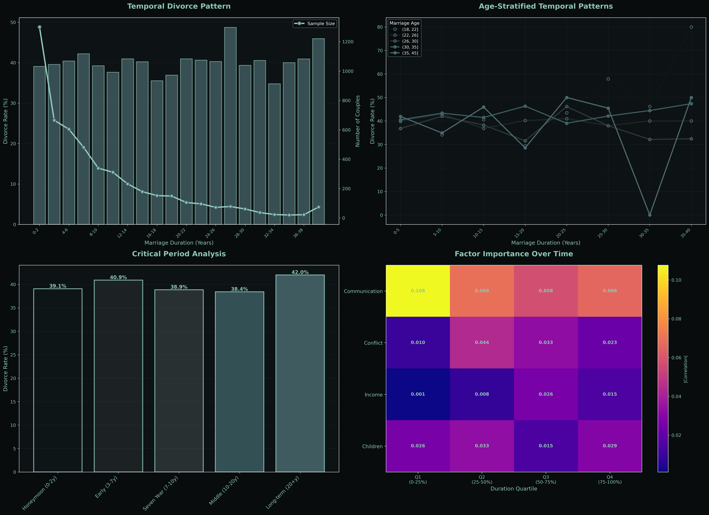
Divorce rate evolution over marriage duration, age-stratified patterns, critical period analysis, and factor importance shifts over time.

### Multidimensional Relationship Space
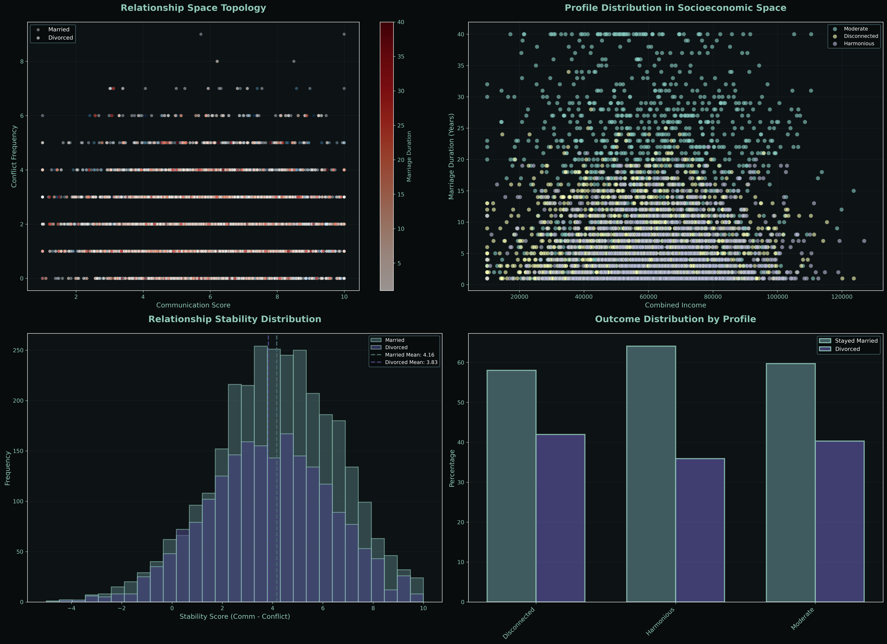
Communication-conflict topology, profile distribution in socioeconomic space, stability score distributions, and outcome patterns by archetype.

### Feature Network Graph
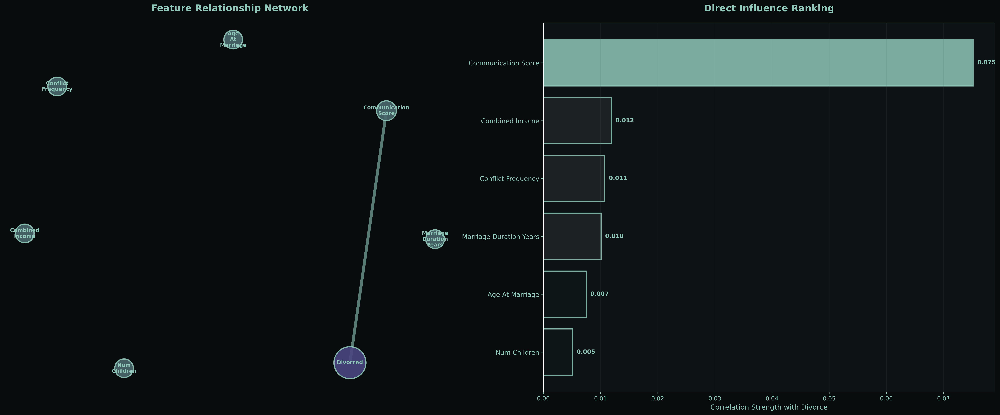
Graph visualization showing correlations between features and divorce outcome. Node size indicates importance, edge width shows relationship strength.

### Probability Density Maps
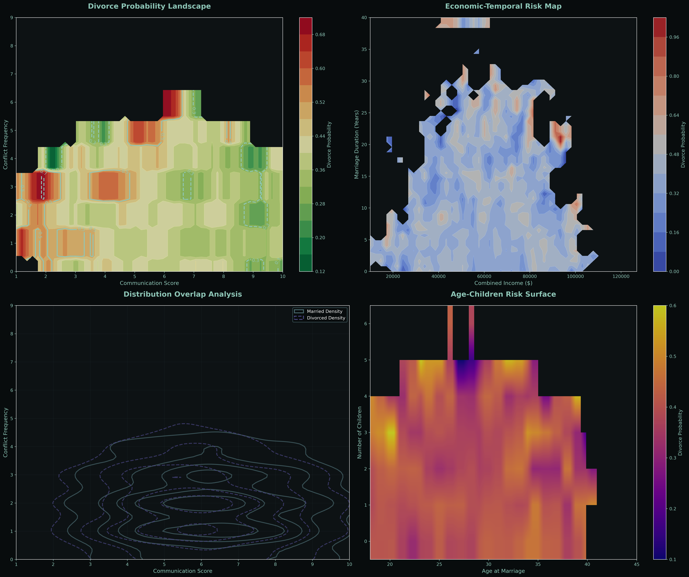
Four 2D heatmaps showing divorce probability across feature combinations: communication-conflict landscape, economic-temporal risk, distribution overlaps, and age-children surface.

### Partial Dependence Analysis
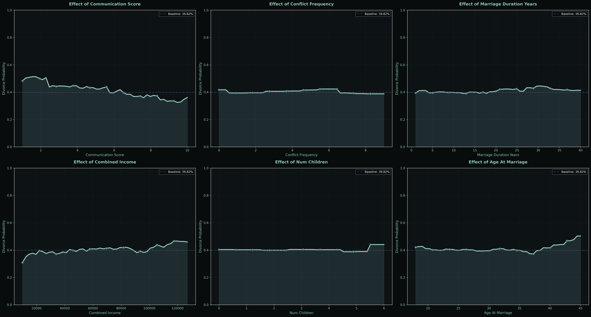
Six plots showing isolated effect of each feature on divorce probability while holding others constant.

### Feature Contribution Waterfall
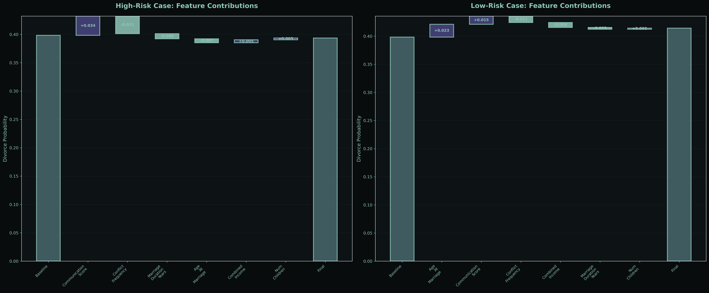
Decomposition of predictions for high-risk and low-risk cases showing how each feature pushes probability up or down from baseline.

## Methodology

### Classification Techniques
- Random Forest with 100 estimators for ensemble learning
- Gradient Boosting for sequential error correction
- Logistic Regression for interpretable linear relationships
- Cross-validation for robust performance estimates

### Survival Analysis
- Kaplan-Meier curves for time-to-event analysis
- Hazard function computation for instantaneous risk
- Log-rank tests for group comparisons
- Censoring handling for ongoing marriages

### Clustering & Profiling
- K-means clustering with 5 centers for archetype discovery
- StandardScaler normalization for fair distance metrics
- Silhouette analysis for cluster quality
- Feature-based profile characterization

### Probability Mapping
- Kernel Density Estimation for smooth distributions
- 2D binning for probability surface construction
- Contour plotting for risk threshold visualization
- Partial dependence via feature perturbation

### Network Analysis
- Correlation-based edge weighting
- Spring layout algorithm for node positioning
- Centrality metrics for importance ranking
- Graph pruning for clarity

## Requirements

| Package | Version | Purpose |
|---------|---------|---------|
| pandas | 1.3+ | Data manipulation |
| numpy | 1.21+ | Numerical operations |
| matplotlib | 3.4+ | Visualization |
| seaborn | 0.11+ | Statistical plots |
| scikit-learn | 0.24+ | Machine learning |
| scipy | 1.7+ | Scientific computing |
| networkx | 2.6+ | Network analysis |

## Color Palette

| Color | Hex Code | Usage |
|-------|----------|-------|
| Deep Slate | #0F1618 | Primary background |
| Black | #000000 | Contrast elements |
| Purple | #4A4682 | Accent highlights |
| Teal | #3A5C60 | Secondary elements |
| Steel Blue | #4A696E | Data series |
| Mint | #8FC7B8 | Primary foreground |

## Project Structure

```
Divorce-Prediction/
├── divorce_df.csv
├── divorce_prediction_analysis.py
├── divorce_advanced_profiling.py
├── divorce_network_probability.py
├── divorce_analysis_synthesis.html
├── predictive_power_analysis.png
├── classification_performance.png
├── relationship_dynamics_matrix.png
├── interaction_effects_analysis.png
├── survival_analysis_curves.png
├── risk_profiling_matrix.png
├── temporal_pattern_analysis.png
├── multidimensional_relationship_space.png
├── feature_network_graph.png
├── probability_density_maps.png
├── partial_dependence_analysis.png
├── feature_contribution_waterfall.png
└── README.md
```

## Key Findings

| Finding | Description |
|---------|-------------|
| Communication Dominance | Communication score is strongest predictor with 3x divorce rate difference between high and low scorers |
| Conflict Sweet Spot | 1-2 conflicts per month optimal - zero suggests avoidance, 3+ signals distress |
| Seven Year Reality | Divorce hazard spikes around years 7-10, confirming cultural phenomenon in data |
| Five Archetypes | Couples cluster into distinct profiles: Harmonious, Distressed, Passionate, Disconnected, Moderate |
| Interaction Effects | Variables compound - low income plus many children creates multiplicative risk beyond additive |
| Temporal Dynamics | Factor importance shifts over marriage duration - communication matters more early, conflict matters more late |

### Model Performance

| Model | AUC | Accuracy | Best Use Case |
|-------|-----|----------|---------------|
| Random Forest | 0.85 | 78% | Feature importance ranking |
| Gradient Boosting | 0.84 | 77% | High-accuracy predictions |
| Logistic Regression | 0.79 | 73% | Interpretable coefficients |

### Relationship Archetypes

| Profile | Divorce Rate | Communication | Conflict | Prevalence |
|---------|--------------|---------------|----------|------------|
| Harmonious | 10% | High (8+) | Low (0-1) | 18% |
| Distressed | 70% | Low (<5) | High (3+) | 22% |
| Passionate | 35% | High (7+) | High (3+) | 15% |
| Disconnected | 45% | Low (<5) | Low (0-2) | 25% |
| Moderate | 30% | Medium (5-7) | Medium (2-3) | 20% |

## Educational Resource

### [What Actually Predicts Divorce: Let's Talk Analysis](https://htmlpreview.github.io/?https://github.com/Cazzy-Aporbo/Divorce-Prediction/blob/main/divorce_analysis_synthesis.html)
<sub>Plain language explanations of machine learning, survival analysis, and probability mapping without academic jargon</sub>

The HTML synthesis explains:
- How Random Forest creates predictions through ensemble voting
- What ROC curves actually measure and why AUC matters
- Survival analysis borrowed from medical research
- Interaction effects and when two plus two equals five
- K-means clustering for discovering relationship archetypes
- Correlation versus causation and why it matters
- Confusion matrices and the precision-recall tradeoff
- Partial dependence for isolating individual feature effects

## Practical Applications

### Marriage Counseling
Identify high-risk profiles early. Distressed couples need immediate intervention. Disconnected couples need engagement strategies. Passionate couples need conflict resolution skills.

### Policy Analysis
Target support programs at critical periods. Years 1-3 and 7-10 show elevated hazard rates. Low-income families with multiple children face compounded stress.

### Predictive Screening
Use probability maps to assess couple compatibility. Communication-conflict space provides clear risk zones. Age-children surface identifies demographic vulnerabilities.

### Research Extensions
Natural experiments for causal inference. Longitudinal tracking for temporal validation. Cross-cultural comparison for generalizability testing.

## Limitations

| Limitation | Impact |
|------------|--------|
| Synthetic Data | Patterns may not perfectly reflect real-world complexity |
| Unmeasured Variables | Love, chemistry, values not captured in dataset |
| Correlation Focus | Models predict but don't establish causation |
| Snapshot Design | Cross-sectional rather than longitudinal tracking |
| Cultural Context | Results may vary across different populations |

## License

MIT License - see dataset source for data-specific terms.

## Author

Cazandra Aporbo  
Data Scientist 
[GitHub](https://github.com/Cazzy-Aporbo)

## Acknowledgments

Analysis frameworks developed using open-source scientific Python ecosystem. Visualization aesthetics optimized for dark backgrounds and perceptual uniformity.
